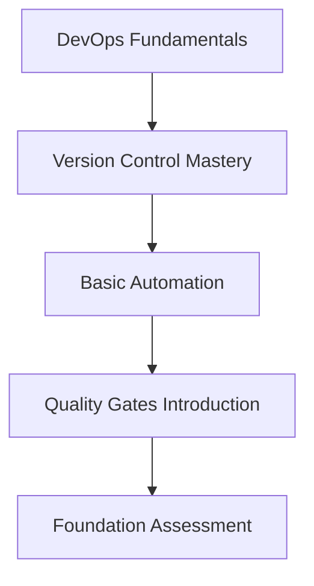
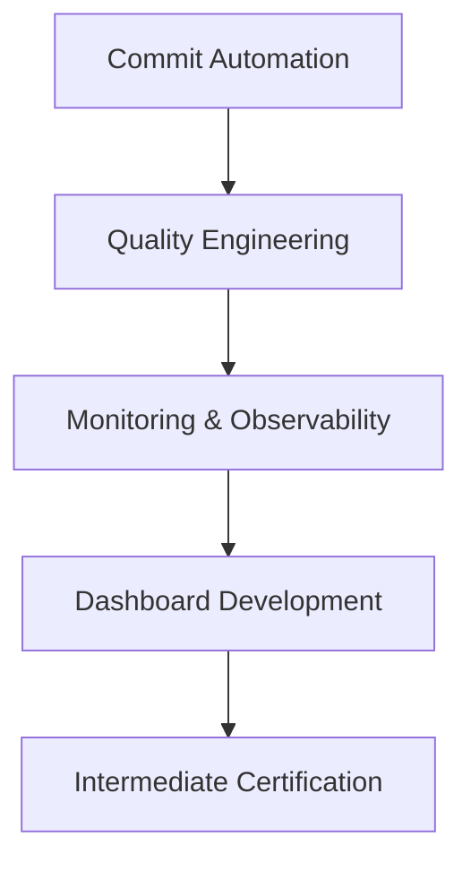
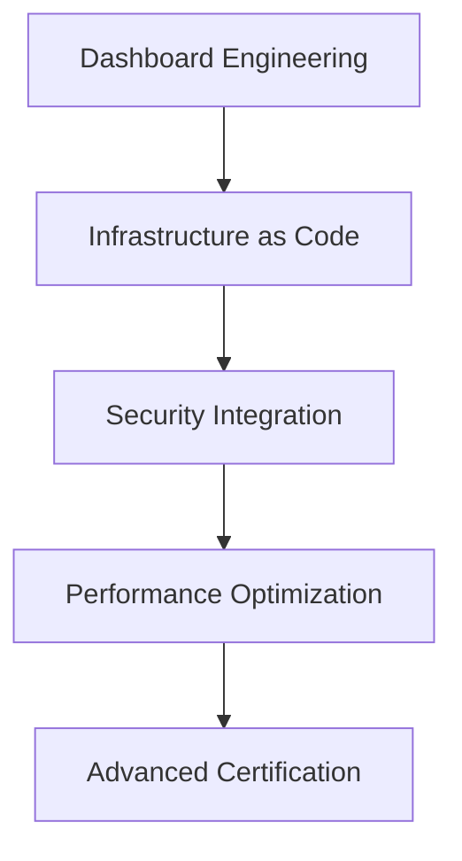
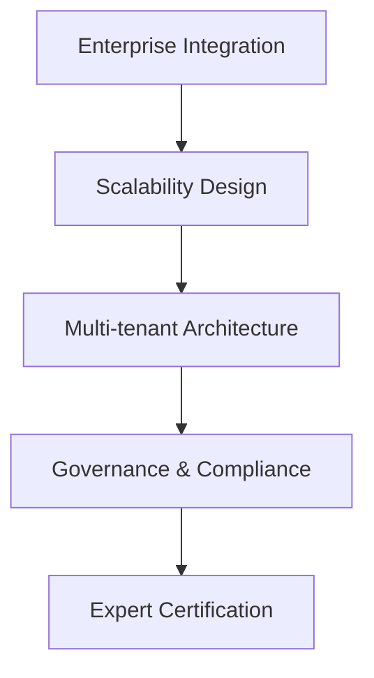

# 🎓 MoodBridge DevOps Academy - Learning Paths

## Overview

The MoodBridge DevOps Academy provides structured learning paths designed to take you from DevOps beginner to enterprise expert. Our curriculum is built around real-world scenarios and hands-on practice with the MoodBridge ecosystem.

## 🗺️ Learning Path Overview

### Path 1: Foundation Track (Beginner)
**Duration**: 2-3 weeks  
**Commitment**: 5-10 hours/week  
**Prerequisites**: Basic Git knowledge

#### Modules:
1. **DevOps Fundamentals** (Module 1)
   - Understanding DevOps principles
   - MoodBridge system architecture
   - Development environment setup
   - Basic command-line operations

2. **Version Control Mastery**
   - Advanced Git workflows
   - Branching strategies
   - Commit message standards
   - Conflict resolution

3. **Basic Automation**
   - Introduction to scripts
   - Simple automation tasks
   - Understanding shell scripting
   - Basic CI/CD concepts

### Path 2: Intermediate Track (Developer)
**Duration**: 3-4 weeks  
**Commitment**: 8-12 hours/week  
**Prerequisites**: Foundation Track completion

#### Modules:
1. **Commit Automation** (Module 2)
   - Multi-project monitoring
   - Automated reporting systems
   - Cross-repository analysis
   - Performance optimization

2. **Quality Engineering** (Module 3)
   - Pre-commit hook development
   - Code quality metrics
   - Security scanning
   - Test automation integration

3. **Monitoring & Observability**
   - System monitoring setup
   - Log aggregation
   - Performance metrics
   - Alert configuration

### Path 3: Advanced Track (DevOps Engineer)
**Duration**: 4-6 weeks  
**Commitment**: 10-15 hours/week  
**Prerequisites**: Intermediate Track completion

#### Modules:
1. **Dashboard Engineering** (Module 4)
   - Modern UI development
   - Real-time data visualization
   - Interactive components
   - Responsive design principles

2. **Infrastructure as Code**
   - Configuration management
   - Environment provisioning
   - Container orchestration
   - Cloud integration

3. **Security Integration**
   - Security scanning automation
   - Vulnerability management
   - Compliance monitoring
   - Security policy enforcement

### Path 4: Expert Track (Enterprise Architect)
**Duration**: 6-8 weeks  
**Commitment**: 15-20 hours/week  
**Prerequisites**: Advanced Track completion

#### Modules:
1. **Enterprise Integration** (Module 5)
   - Large-scale system design
   - Enterprise tool integration
   - Workflow orchestration
   - Change management

2. **Scalability Design**
   - Distributed systems
   - Load balancing
   - Auto-scaling strategies
   - Performance tuning

3. **Governance & Compliance**
   - Policy enforcement
   - Audit trail management
   - Compliance reporting
   - Risk management

## 🎯 Specialized Learning Tracks

### Track A: Rust Developer Path
**Focus**: Rust-specific DevOps practices

1. **Rust Toolchain Mastery**
   - Cargo ecosystem
   - Build optimization
   - Dependency management
   - Cross-compilation

2. **Rust Testing & Quality**
   - Unit testing strategies
   - Integration testing
   - Property-based testing
   - Benchmark optimization

3. **Rust Deployment**
   - Container packaging
   - Binary optimization
   - Production monitoring
   - Memory safety verification

### Track B: Enterprise Security Path
**Focus**: Security-first DevOps

1. **Security Fundamentals**
   - Threat modeling
   - Secure coding practices
   - Vulnerability assessment
   - Incident response

2. **DevSecOps Integration**
   - Security in CI/CD
   - Automated security testing
   - Compliance automation
   - Security monitoring

3. **Enterprise Security Architecture**
   - Zero-trust principles
   - Identity management
   - Access control systems
   - Security governance

### Track C: Cloud Operations Path
**Focus**: Cloud-native DevOps

1. **Cloud Fundamentals**
   - Multi-cloud strategies
   - Service selection
   - Cost optimization
   - Migration planning

2. **Container Orchestration**
   - Kubernetes mastery
   - Service mesh implementation
   - Observability stack
   - GitOps workflows

3. **Cloud Architecture**
   - Microservices design
   - Event-driven architecture
   - Disaster recovery
   - Global distribution

## 📚 Learning Resources by Module

### Module 1: DevOps Foundation
- **Required Reading**: 
  - `DEVOPS_IMPLEMENTATION_GUIDE.md`
  - `DEVOPS_IMPLEMENTATION_SUMMARY.md`
- **Hands-on Labs**:
  - Lab 1.1: Environment Setup
  - Lab 1.2: First Commit Analysis
  - Lab 1.3: Basic Automation
- **Assessment**: Foundation Quiz (20 questions)

### Module 2: Commit Automation
- **Required Reading**:
  - DevOps configuration documentation
  - Commit checker source code analysis
- **Hands-on Labs**:
  - Lab 2.1: Multi-repo Setup
  - Lab 2.2: Custom Report Generation
  - Lab 2.3: Performance Optimization
- **Assessment**: Automation Practical (Build working system)

### Module 3: Quality Gates
- **Required Reading**:
  - Pre-commit hook documentation
  - Rust toolchain guides
- **Hands-on Labs**:
  - Lab 3.1: Custom Hook Development
  - Lab 3.2: Security Integration
  - Lab 3.3: Performance Testing
- **Assessment**: Quality System Implementation

### Module 4: Dashboard Development
- **Required Reading**:
  - Modern web development practices
  - Data visualization principles
- **Hands-on Labs**:
  - Lab 4.1: Dashboard Framework
  - Lab 4.2: Real-time Updates
  - Lab 4.3: Mobile Responsiveness
- **Assessment**: Dashboard Portfolio Project

### Module 5: Enterprise Integration
- **Required Reading**:
  - Enterprise architecture patterns
  - Scalability best practices
- **Hands-on Labs**:
  - Lab 5.1: Large-scale Deployment
  - Lab 5.2: Multi-tenant Configuration
  - Lab 5.3: Governance Implementation
- **Assessment**: Capstone Project + Oral Exam

## 🏆 Certification Levels

### 🥉 DevOps Foundation Certified
- Complete Foundation Track
- Pass Foundation Assessment (80%+)
- Complete 3 hands-on labs
- **Valid for**: 2 years

### 🥈 DevOps Professional Certified
- Complete Foundation + Intermediate Tracks
- Pass Professional Assessment (85%+)
- Complete capstone project
- **Valid for**: 3 years

### 🥇 DevOps Expert Certified
- Complete all tracks through Advanced
- Pass Expert Assessment (90%+)
- Complete portfolio of projects
- Peer review participation
- **Valid for**: 5 years

### 💎 DevOps Master Certified
- Complete Expert Track
- Pass Master Assessment (95%+)
- Mentor junior learners
- Contribute to academy content
- **Valid for**: Lifetime

## 📈 Progress Tracking

### Achievement System
- **Completion Badges**: For finishing modules
- **Excellence Badges**: For high assessment scores
- **Contribution Badges**: For helping others
- **Innovation Badges**: For creative solutions

### Learning Analytics
- Time spent per module
- Assessment performance trends
- Hands-on lab completion rates
- Peer interaction metrics

### Personalized Learning
- Adaptive difficulty based on performance
- Customized resource recommendations
- Personal learning path optimization
- Mentorship matching

## 🤝 Community Learning

### Study Groups
- Cohort-based learning
- Peer programming sessions
- Group projects
- Knowledge sharing

### Mentorship Program
- Expert mentors available
- One-on-one guidance
- Career development advice
- Technical skill coaching

### Open Source Contributions
- Academy content improvements
- Tool development
- Documentation enhancements
- Best practice sharing

## 📅 Flexible Learning Options

### Self-Paced Learning
- Learn at your own speed
- Flexible scheduling
- Repeat modules as needed
- Personal progress tracking

### Instructor-Led Cohorts
- Structured timeline
- Live sessions with experts
- Group collaboration
- Immediate feedback

### Corporate Training
- Customized curricula
- On-site delivery options
- Team-based learning
- Executive briefings

## 🎓 Graduation Requirements

### Portfolio Development
Each learner must develop a comprehensive portfolio including:

1. **Technical Projects**
   - Working DevOps implementations
   - Custom automation solutions
   - Dashboard applications
   - Documentation contributions

2. **Case Studies**
   - Real-world problem solving
   - Process improvement examples
   - Performance optimization stories
   - Security enhancement cases

3. **Teaching & Mentoring**
   - Peer assistance examples
   - Knowledge transfer activities
   - Community contributions
   - Content creation

### Continuous Learning
- Annual recertification requirements
- Continuing education credits
- Industry trend awareness
- Technology update training

---

## 🚀 Getting Started

1. **Assessment**: Take our skill assessment quiz
2. **Path Selection**: Choose your learning track
3. **Environment Setup**: Configure your development environment
4. **First Module**: Begin with DevOps Foundation
5. **Community**: Join our learning community

Ready to begin your DevOps journey? Start with the academy dashboard and take your first steps toward becoming a DevOps expert!

For questions or support, contact our learning team or join our community discussions.
